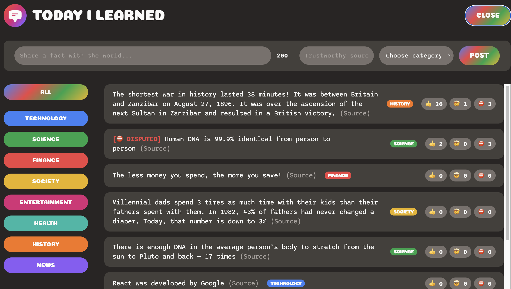

# Today I Learned Web Application

This project is a simple web application that allows users to record information they learn daily, including the source and category. Users can also share their posts, and others can react to the shared information.



## Features

- Ability to enter information, source, and category
- Users can react to shared information
- Developed using React
- Includes NPM packages

## Installation

1. Clone this repository to your computer.
   ```bash
   git clone https://github.com/civanozbay/Today-I-Learned.git
Navigate to the project directory.
```bash
  cd Today-i-learned
```
Install the required dependencies.
  ```bash
npm install
```
Start the application.
```bash
npm start
```
Go to http://localhost:3000 in your browser.

Usage

After starting the application, you can add information or view information added by other users on the home page.
To add information, click the "Add New Information" button, enter the required details, and share it.
You can react to information added by other users.
